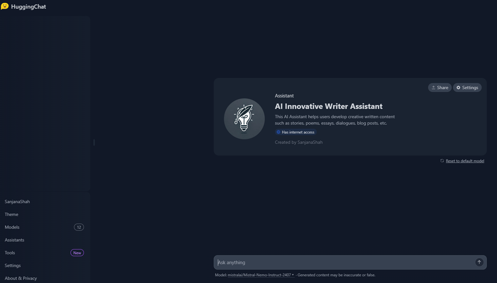

# ✍️ Creative Writer Assistant — No-Code Generative AI App

🚀 An innovative no-code Generative AI app built on the HuggingChat platform that empowers users to generate creative stories, poems, and essays — no coding required.

---

## 🔗 Live Demo
👉 [Launch the App](https://huggingface.co/chat/assistant/67e2371776d15f879d970f8f)

---

## 💡 Features
- 📝 AI-generated creative writing: stories, poems, and essays
- 🎨 Thematic writing prompts and idea generation
- ✏️ Editable outputs tailored for writers, students, and educators
- 🧠 Powered by HuggingFace LLMs via HuggingChat Assistants

---

## 🛠️ Tech Stack
- **Platform**: HuggingChat (HuggingFace)
- **Development Style**: 100% No-code assistant builder
- **Deployment**: Hosted directly on HuggingFace Chat Assistants- Hosted on HuggingFace Chat Assistants

---

## 📸 Screenshots

---

## 📄 License
This repository and its contents are released under the **MIT License**.  
Note: The HuggingChat interface and any underlying models are subject to their respective licenses.

> ⚠️ **Disclaimer**: This app leverages HuggingChat, which runs models like Mistral, LLaMA, etc., each with their own license.  
> Please check the individual model licenses on [HuggingFace Model Hub](https://huggingface.co/models) before using this project commercially.

---

## 👤 Author
shahsanjanav
*ML/AI Enthusiast*

---